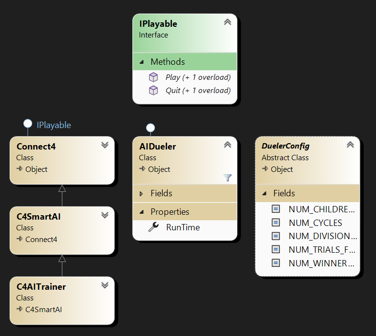

# Connect 4 AI with Genetic Programming 🤖

## Description:
An AI that plays Connect 4, trained through genetic programming. This project came from a simple desire to  play with genetic programming. The end result is by no means perfect. In fact, it is quite easy to trick the AI given that it does not have the ability to look multiple moves ahead. Regardless, if you would like to read the details on the AI was trained, see ["Process for generating finalTuning.json"](#process-for-generating-finaltuningjson) down below. There are also instructions on how to [play the AI](#play-the-ai-instructions) and how to [run the AIDueler](#run-the-aidueler-instructions) (to generate custom tuning values).

## Dependencies
* Must have Microsoft .NET 8.0 installed and added to PATH

## Play the AI: Instructions
* Clone the repo
* In the main repo directory, run `dotnet build` then `dotnet run`

## Run the AIDueler: Instructions
* In `src/Program.cs` modify `Main()` by creating an `AIDueler` object and calling `AIDueler.Play()`
* **Sample code:**
```
private static void Main(string[] args) {
    // comment this out after generating new tuning
    AIDueler dueler = new AIDueler();
    dueler.Play();

    // uncomment this to play the AI
    //C4SmartAI game = new C4SmartAI();
    //game.Play();
}
```
* Modify `src/DuelerConfig.cs` to customize the process for generating `finalTuning.json`
* Run the program (`dotnet build` then `dotnet run`)
* The new tuning will be stored in `res/finalTuning.json`
* To try out the AI with the new tuning, copy and paste the tuning values in `finalTuning.json` into `src/C4AITuning.cs`. Then make sure to create a `C4SmartAI` object and call `C4SmartAI.Play()` in `Main()`. Alternatively, using the code above, uncomment the second code black and comment out `dueler.Play()`. 
Once these conditions are satisfied, again run `dotnet build` and `dotnet run`

## Class Hierarchy Diagram:



## Class Hierarchy Explanation

### DuelerConfig class
* Contains constants used by `AIDueler` for generating AI tuning data
* Changing this config file will change the process for generating this tuning data

### AIDueler class
* Derives from `IPlayable` interface
* Its purpose is to make `C4AITrainer` objects compete and do something with the result (output to appropriate .json file(s))
* The tuning used by `C4SmartAI` comes from the data in `extra/res/finalTuning.json` (generated from `AIDueler.Play()`)

### Process for generating `finalTuning.json`:
* `AIDueler.findNewWinner()` starts with two bots with random tuning. These bots play each other the winner's tuning is saved to the next round, where it fights another random AI. The previous winner's tuning is overridden with the winner of this round and this process continues for `NUM_TRIALS_FOR_NEW_WINNER` rounds. The tuning of the final resulting winner is returned by the function
* `AIDueler.generateRandomWinners()` runs `AIDueler.findNewWinner()` `NUM_WINNERS_TO_GENERATE` times and pushes all winners to the file `randWinners.json`
* `AIDueler` then performs a series of gene pool repopulations and reductions until we reach a final gene pool. `NUM_CYCLES` is the number of times that the gene pool is repopulated and reduced. Gene pool repopulations are done by breeding the organisms in the gene pool using uniform crossover
* The final gene pool is then divided in half through a series of matches where the loser is removed from the pool
* When only one organism remains, its tuning is pushed to the file `finalTuning.json`

#### Critiques:
* I might have gotten a better tuning if I added the possibility for mutation in `AIDueler.repopulatePool()`. Currently, the gene pool homogenizes fairly quickly so running more cycles is useless

### C4AITrainer class
* Derives from `C4SmartAI` class
* Has public methods `Move()` and `OpponentMove()` which can be used by `AIDueler` to put two `C4AITrainer` objects against each other